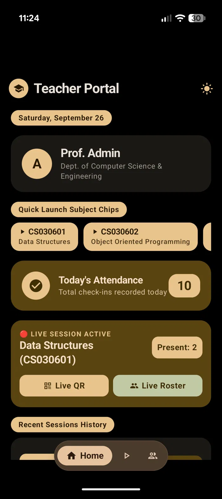
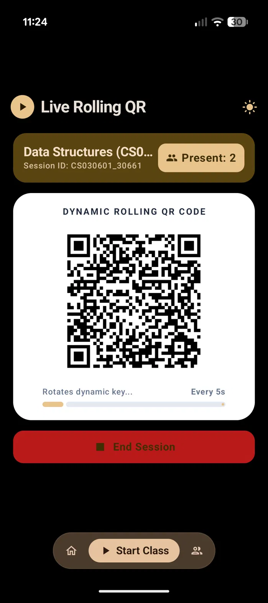
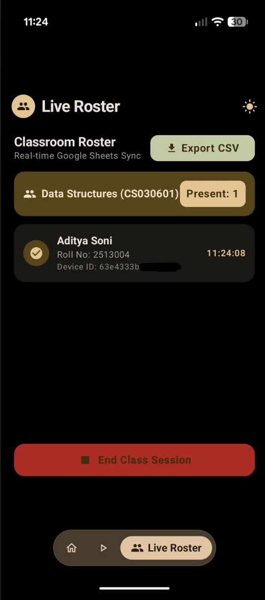
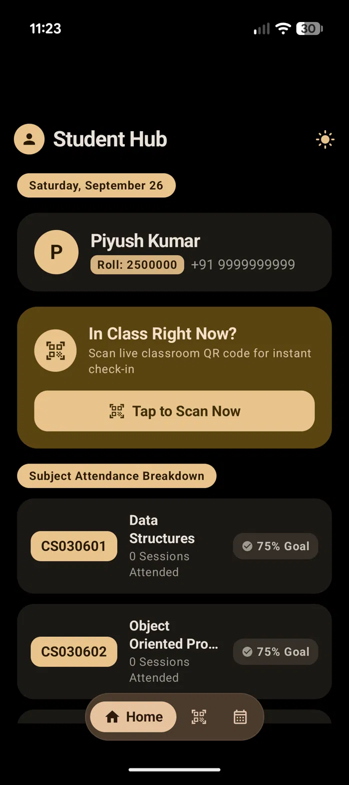
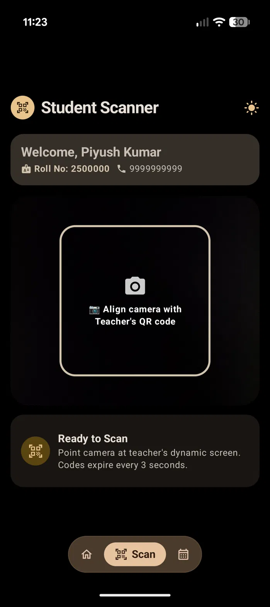
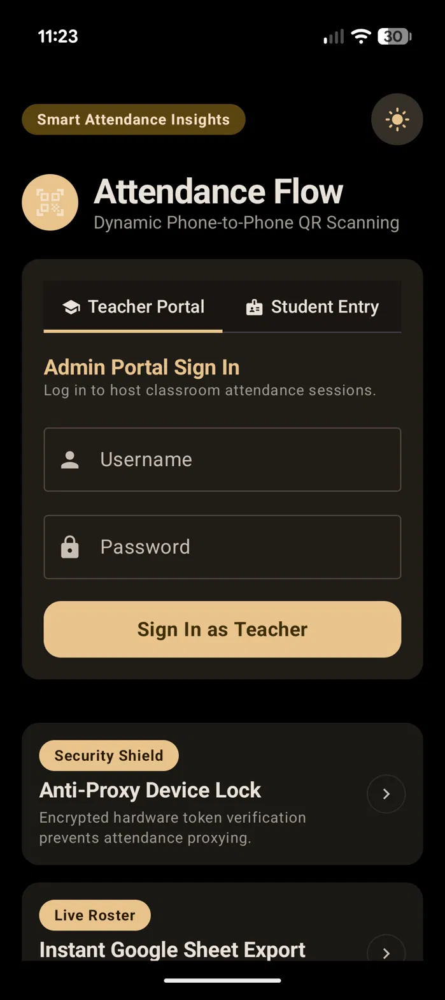

# 🎯 Attendance Flow — Material You Classroom App

> A native Material You Android attendance tracking system using dynamic rolling QR codes and real-time Google Sheets backend integration. Built specifically for college and university environments.

---

## 📸 Screenshots

| Teacher Portal | Live Rolling QR | Live Roster |
|---|---|---|
|  |  |  |

| Student Hub | Student Scanner | Admin Login |
|---|---|---|
|  |  |  |

---

## 📱 Features

### 👨‍🏫 Professor / Teacher Portal

* **Dynamic Session Generation:** Generates short-lived rolling QR codes bound to university course codes (`CS030601` - Data Structures, `CS030602` - OOP, `CS030603` - DBMS, `CS030604` - Discrete Math, `CS030605` - OS, `HS030601` - Ethics).
* **Live Roster Sync:** Real-time incoming check-in feed syncing directly with Google Sheets with CSV export capabilities.
* **Idle & Active Session Control:** Automatically locks roster feeds when sessions end so legacy scans do not bleed into closed classes.

### 👨‍🎓 Student Portal & Attendance Analytics

* **Instant QR Scanner:** Built-in scanner verifying dynamic session hashes in under 2 seconds.
* **B.Tech CSE Subject Breakdown:** Personal tracking dashboard tailored directly to semester curriculum courses.
* **75% Attendance Insight Engine:** Real-time calculation providing actionable metrics:
  * **Safe Status:** Exact count of remaining allowed bunks while staying safely above 75%.
  * **Warning Status:** Exact count of consecutive mandatory classes needed to recover attendance.
* **Support & Danger Zone:** Clean, isolated account management with a dedicated "Contact Support" card and high-contrast "Log Out" action button at the bottom of the Home screen.

---

## 🎨 UI/UX & Design Highlights

* **Expressive Material 3 Design:** Built with warm AMOLED dark theme surfaces, dynamic color tokens, and custom card styling.
* **Large Floating Navigation Pill:** Oversized, comfortable navigation bar container with high-contrast active tab indicators matching modern Android design standards.
* **Edge-to-Edge Scroll Flow:** Content glides smoothly behind a translucent frosted-glass navigation bar with generous bottom clearance.
* **Clean Top App Bar:** Minimalist header layout keeping screen clutter to an absolute minimum.

---

## 🛡️ Security & Anti-Proxy Architecture

* **Hardware Device Binding:** Ties check-ins to unique physical `Device ID` hardware strings to prevent proxy logins across multiple phones.
* **Strict Roll Number Matching:** Enforces strict string equality on university Roll Numbers to eliminate duplicate row counts.
* **Time-Sensitive Session Hashes:** Appends random short-lived hashes (`_57661`) to QR codes to prevent students from sharing screenshot codes remotely.

---

## 🛠️ Tech Stack & Architecture

* **Frontend UI:** Android Native (Kotlin / Jetpack Compose / Material 3 Dark Theme)
* **Backend Infrastructure:** Google Apps Script (`doGet` / `doPost` Web App endpoints) + Google Sheets Database
* **Data Flow Architecture:**
